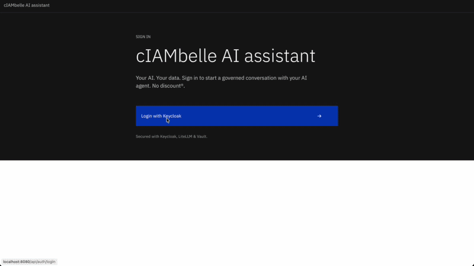
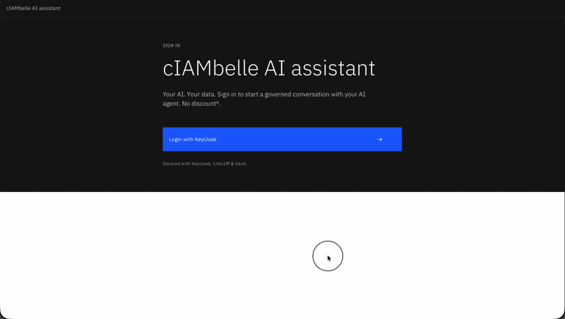

## Build/Deploy

create a setenv file based on the example

```bash
cd docker-compose/
# setenv is hardcoded with ephemeral demo keys. It's safe.
. ./setenv
make
````

#### URLs
WebApp UI: [localhost:8080](http://localhost:8080)  
Keycloak: [localhost:8081](http://localhost:8081)  
LiteLLM: [localhost:4000/ui](http://localhost:4000/ui)  
Vault: [localhost:8200](http://localhost:8200)

Keycloak userpass admin/admin  
LiteLLM is SSO-enabled via Keycloak, userpass admin/admin  
Vault, check logs for token  

## Running the demo
#### Privileged user with write permissions
username: admin  
password: admin  
  
(00:50)


#### Read-only user
username: user  
password: user  
  
(00:30)


OBS: This is a demo app to showcase Vault capabilities and was not extensively tested in terms of AI agent complex prompts. Plase use simple commands like *list*, *create*, *etc*. 
For **create_user** tool, only first name and email are enforced. If the model complains, be specific.  